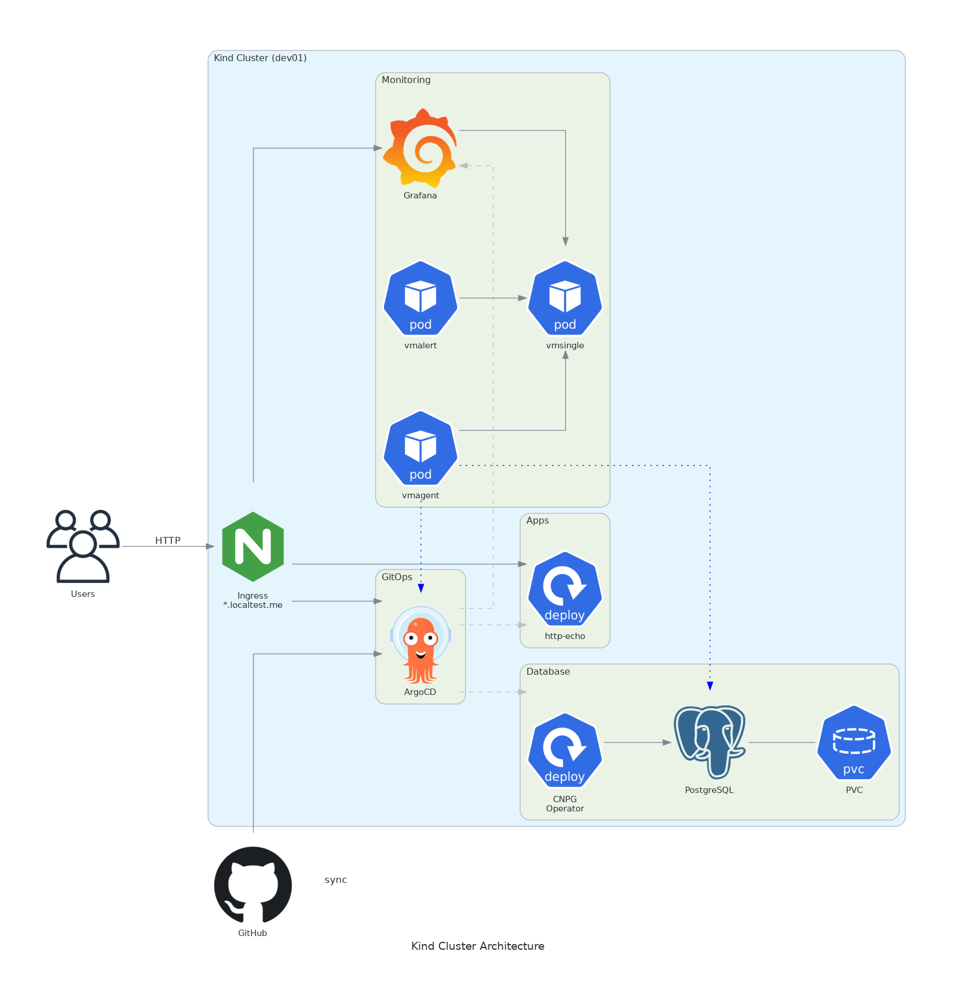

# gitops-k8s-lab

Local Kubernetes environment. GitOps with ArgoCD. Needs Docker and make.

## Architecture


## Quick start

```bash
# Prerequisites: Docker + make
./start.sh
```


## Access

- [Echo Service](https://echo.localtest.me)
- [Grafana](https://grafana.localtest.me)
- [ArgoCD](https://argocd.localtest.me)
- [VictoriaMetrics](https://vmsingle.localtest.me)
- [VMAgent](https://vmagent.localtest.me)
- PostgreSQL: `localhost:5432` 

## Access with kubectl

```
export KUBECONFIG=.kube/config
kubectl get pods -A
kubectl get apps -A
```


## Credentials

```bash
make argocd-info    # ArgoCD credentials
make grafana-info   # Grafana credentials
```


## Local domain

`localtest.me` resolves to 127.0.0.1, so no /etc/hosts editing.


## TLS (optional)

```bash
make tls        # Generate wildcard certs with mkcert (runs in Docker)
make trust-ca   # Trust the CA on your host OS (for browser HTTPS)
```

## Components

- **[kind](https://kind.sigs.k8s.io/)**: Kubernetes in Docker, vanilla k8s with etcd, scheduler, controller-manager.
- **[ArgoCD](https://argo-cd.readthedocs.io/)**: GitOps, App-of-Apps pattern.
- **[ingress-nginx](https://kubernetes.github.io/ingress-nginx/)**: Nignx ingress controller.
- **[CloudNativePG](https://cloudnative-pg.io/)**: PostgreSQL operator.
- **[VictoriaMetrics](https://docs.victoriametrics.com/)**: Monitoring (VMSingle, VMAgent, VMAlert, Alertmanager)
- **[Grafana](https://grafana.com/docs/)**: Dashboards for ArgoCD, CloudNativePG.
- **[mkcert](https://github.com/FiloSottile/mkcert)**: Local TLS, wildcard for *.localtest.me

## Make targets

```bash
make help          # Show all targets
make docker-build  # Build Docker image with tools
make run           # Interactive shell in Docker
make install       # Install kind cluster with ArgoCD
make tls           # Setup TLS certificates
make trust-ca      # Trust CA on host machine
make test          # Run ShellCheck + Helm lint
make lint          # Lint Helm charts and YAML
make clean         # Delete the cluster
make argocd-info   # Show ArgoCD credentials
make grafana-info  # Show Grafana credentials
make postgresql-info  # Show PostgreSQL credentials
make download-dashboard ID=1860 NAME=grafana # Download a Grafana dashboard
```

## Cleanup

```bash
make clean
```

## Docs

- [Tutorial](docs/tutorial.md):  Step-by-step deployment
- [How-to guides](docs/howto.md):  Common tasks 
- [Reference](docs/reference.md):  Ports, URLs, config 
- [Explanation](docs/explanation.md):  Why things are the way they are 

## Design choices

- Docker + make on the host. All tools run in a container.
- ArgoCD App-of-Apps. One bootstrap Application deploys everything else.
- CloudNativePG instead of raw StatefulSets for PostgreSQL.
- Tool versions pinned in the Dockerfile.
- TLS on by default.

## Use as template

Fork or clone this repo, then update `.env`:

```bash
# Required: Your git repository URL
BOOTSTRAP_REPO_URL="https://github.com/YOUR_USER/YOUR_REPO.git"
BOOTSTRAP_TARGET_REVISION="main"  # or your branch

# Optional: Rename the cluster
CLUSTER_NAME="dev01"

# Optional: Change image name
IMAGE_NAME="gitops-k8s-lab:0.0.1"
```

The bootstrap chart in `apps/bootstrap/` defines which apps get deployed. Edit `apps/bootstrap/templates/` to add or remove applications.


## What's missing

A couple of things I'd add next:

- **Secrets in git.** Right now secrets are generated at install time or by operators. [Sealed Secrets](https://sealed-secrets.netlify.app/) would let you commit encrypted secrets to the repo and have them decrypted in-cluster.
- **Database backups.** CloudNativePG supports [barman](https://cloudnative-pg.io/documentation/current/backup_barmanobjectstore/) for automated WAL archiving to S3. Adding [MinIO](https://min.io/) to the cluster would give a local S3 endpoint to test backup/restore without an AWS account.

- **Centralized logging.** [VictoriaLogs](https://docs.victoriametrics.com/victorialogs/) from the VictoriaMetrics team. 
